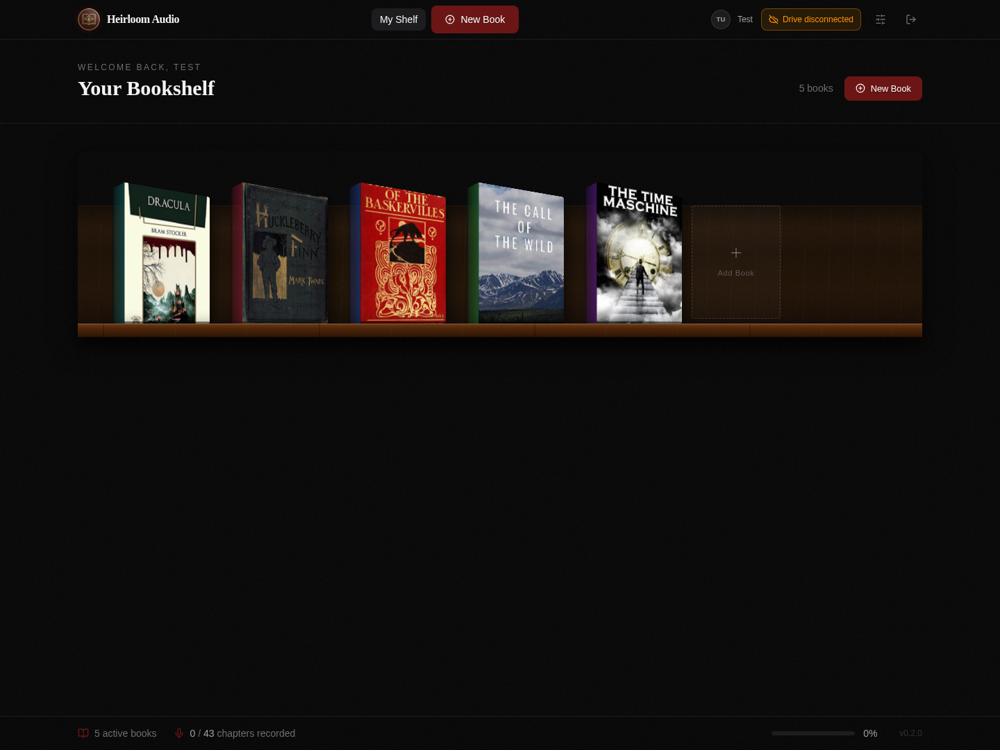
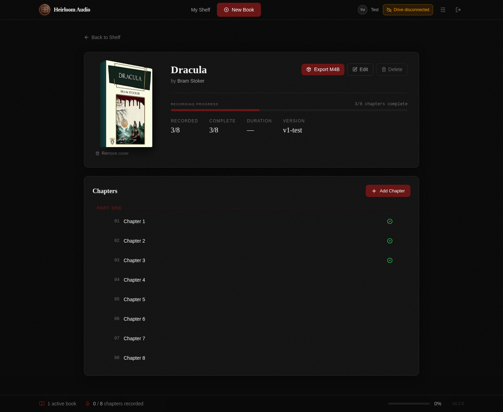
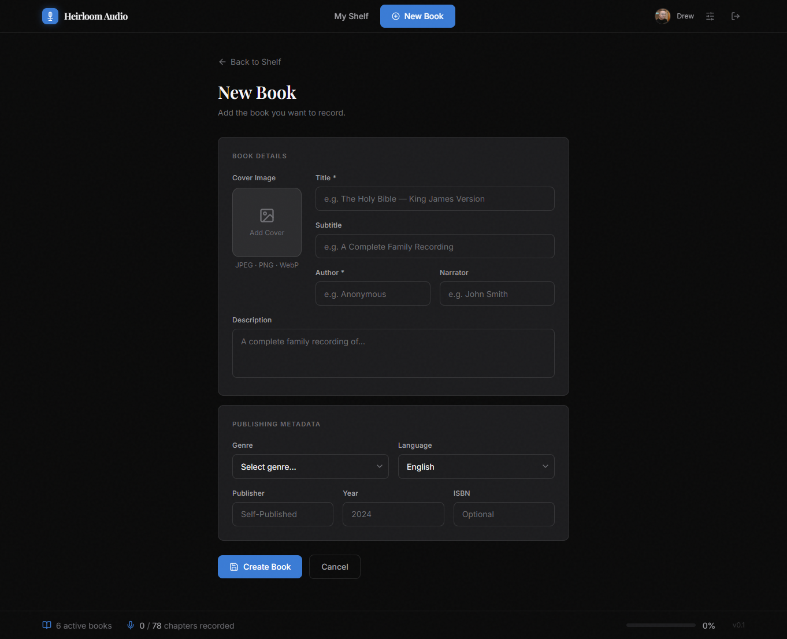
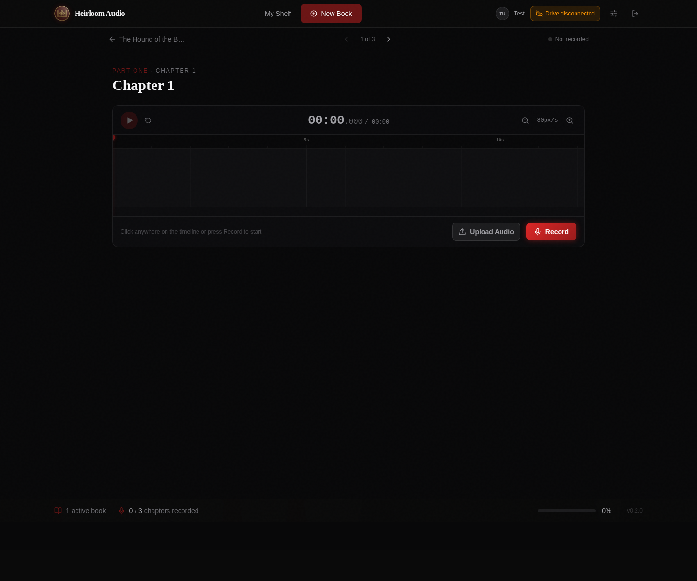
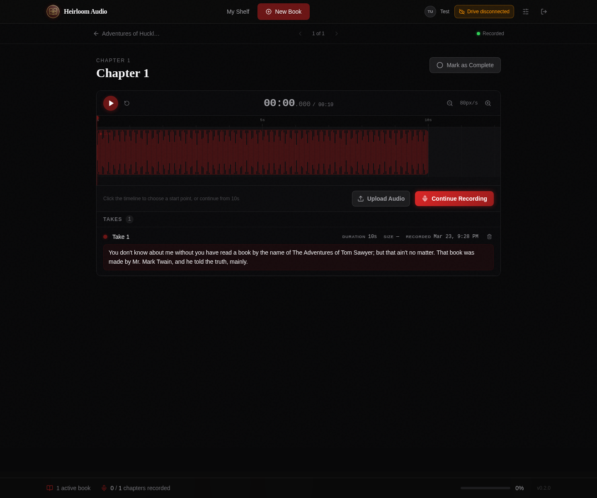
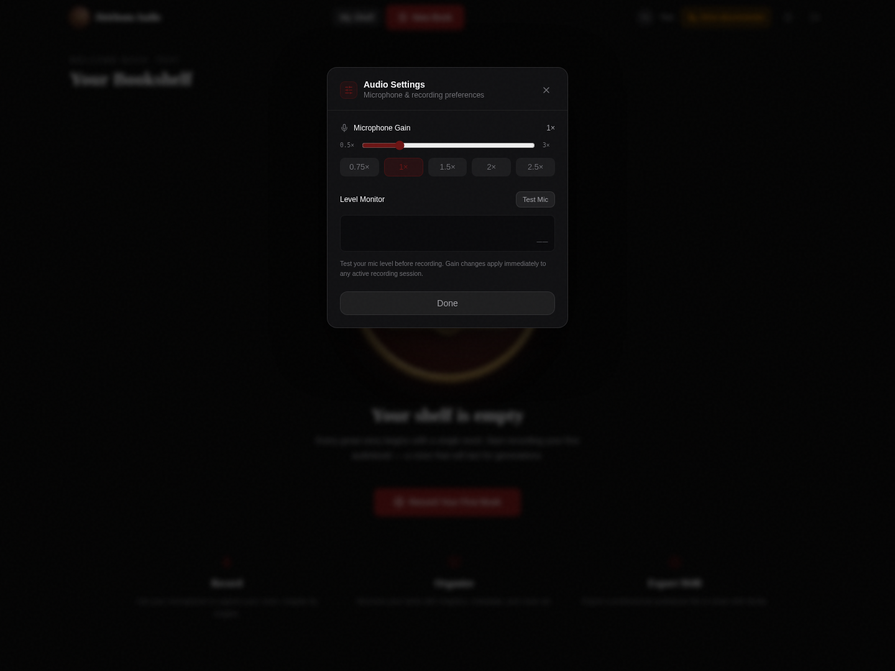
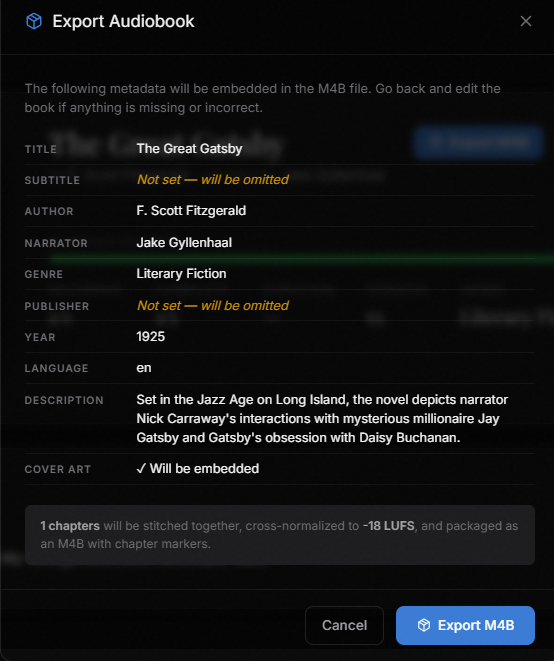
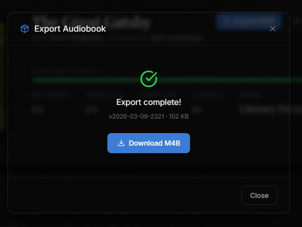

<p align="center">
  
</p>

# Heirloom Audio

[](https://github.com/drewdah/heirloom-audio/actions/workflows/test.yml)
[](https://github.com/drewdah/heirloom-audio/actions/workflows/e2e.yml)
[](https://github.com/drewdah/heirloom-audio/actions/workflows/security.yml)

> *Record, produce, and share audiobooks with the people you love.*

Heirloom Audio is a self-hosted web app for recording professional-quality M4B audiobooks.

---

## ✨ Features

- 📚 **Skeuomorphic bookshelf** — beautiful dark library UI
- 🎙 **In-browser recording** — record chapter by chapter with your microphone
- ☁️ **Google Drive storage** — audio stored in your own Drive
- 📝 **Auto-transcription** — local Whisper AI, no API key needed
- 🎛 **Audio processing** — FFmpeg/SoX presets (EQ, de-esser, normalize)
- 📦 **M4B export** — professional audiobook with chapter markers
- 🔒 **Self-hosted** — your data, your server

---


## 📸 Screenshots

<table>
  <tr>
    <td align="center">
      <a href="https://raw.githubusercontent.com/drewdah/heirloom-audio/refs/heads/main/.github/assets/shelf-row.png" target="_blank"></a>
      <br/><sub><b>Personal bookshelf</b></sub>
    </td>
    <td align="center">
      <a href="https://raw.githubusercontent.com/drewdah/heirloom-audio/refs/heads/main/.github/assets/book-chapters.png" target="_blank"></a>
      <br/><sub><b>Book detail & chapters</b></sub>
    </td>
    <td align="center">
      <a href="https://raw.githubusercontent.com/drewdah/heirloom-audio/refs/heads/main/.github/assets/add-book.png" target="_blank"></a>
      <br/><sub><b>New book setup</b></sub>
    </td>
  </tr>
  <tr>
    <td align="center">
      <a href="https://raw.githubusercontent.com/drewdah/heirloom-audio/refs/heads/main/.github/assets/chapter-recording.png" target="_blank"></a>
      <br/><sub><b>Chapter recording studio</b></sub>
    </td>
    <td align="center">
      <a href="https://raw.githubusercontent.com/drewdah/heirloom-audio/refs/heads/main/.github/assets/chapter-recording-transcription.png" target="_blank"></a>
      <br/><sub><b>Auto-transcription of takes</b></sub>
    </td>
    <td align="center">
      <a href="https://raw.githubusercontent.com/drewdah/heirloom-audio/refs/heads/main/.github/assets/audio-settings.png" target="_blank"></a>
      <br/><sub><b>Microphone & monitor settings</b></sub>
    </td>
  </tr>
  <tr>
    <td align="center">
      <a href="https://raw.githubusercontent.com/drewdah/heirloom-audio/refs/heads/main/.github/assets/export-modal.png" target="_blank"></a>
      <br/><sub><b>M4B export preview</b></sub>
    </td>
    <td align="center">
      <a href="https://raw.githubusercontent.com/drewdah/heirloom-audio/refs/heads/main/.github/assets/m4b-export.png" target="_blank"></a>
      <br/><sub><b>Export complete</b></sub>
    </td>
    <td></td>
  </tr>
</table>

---

## 🚀 Quick Start

### 1. Clone and configure

```bash
git clone https://github.com/yourname/heirloom-audio
cd heirloom-audio
cp .env.example .env
```

### 2. Set up Google OAuth

1. Go to [Google Cloud Console](https://console.cloud.google.com)
2. Create a new project (e.g. "HeirloomAudio")
3. Enable **Google Drive API**
4. Go to **APIs & Services → OAuth consent screen**
   - User type: External (or Internal if using Google Workspace)
   - Add scopes: `email`, `profile`, `https://www.googleapis.com/auth/drive.file`
5. Go to **Credentials → Create Credentials → OAuth 2.0 Client ID**
   - Type: Web application
   - Authorized redirect URIs: `http://localhost:3000/api/auth/callback/google`
6. Copy the Client ID and Secret into your `.env`

### 3. Configure .env

```env
NEXTAUTH_SECRET=          # Run: openssl rand -base64 32
NEXTAUTH_URL=http://localhost:3000
GOOGLE_CLIENT_ID=         # From Google Cloud Console
GOOGLE_CLIENT_SECRET=     # From Google Cloud Console
ALLOWED_EMAILS=           # Comma-separated emails, or leave empty for all
```

### 4. Launch

```bash
docker-compose up -d
```

Open [http://localhost:3000](http://localhost:3000) 🎉

---

## 📁 Google Drive Structure

HeirloomAudio creates this folder structure in your Drive:

```
My Drive/
└── HeirloomAudio/
    └── {Book Title}/
        ├── cover.jpg
        ├── chapters/
        │   ├── 01-Chapter-Name.m4a
        │   └── ...
        └── exports/
            └── v1-2026-03-05.m4b
```

---

## 🎛 Audio Standards

All exports meet professional audiobook platform requirements:

| Spec | Value |
|------|-------|
| Format | M4B (AAC in MPEG-4) |
| Bitrate | 128 kbps |
| Sample Rate | 44,100 Hz |
| Channels | Mono |
| Peak Level | -3 dBFS |
| Loudness | -18 LUFS |
| Cover Art | 3000×3000px JPEG/PNG |

---

## 🏗 Development

```bash
npm install
cp .env.example .env.local
# Set DATABASE_URL=file:./dev.db in .env.local

npx prisma migrate dev
npm run dev
```

---

## 🧪 Testing

The project uses [Vitest](https://vitest.dev) for unit and integration tests, [Playwright](https://playwright.dev) for end-to-end browser tests, and [Trivy](https://trivy.dev) for security scanning.

### Running tests locally

```bash
# Install dependencies (includes test tooling)
npm install

# Run all unit + integration tests
npm test

# Run only unit tests (pure logic, no database)
npm run test:unit

# Run only integration tests (API routes against a test SQLite database)
npm run test:integration

# Watch mode — re-runs tests as you edit files
npm run test:watch
```

### End-to-end tests

E2E tests use Playwright to drive a real browser against the full Docker stack. They require the app to be running.

```bash
# Start the app in test mode (skips Whisper worker and Google Drive)
docker compose -f docker-compose.yml -f docker-compose.ci.yml up -d

# Install Playwright browsers (first time only)
npx playwright install --with-deps chromium

# Run E2E tests
npm run test:e2e

# Run E2E tests with interactive UI
npm run test:e2e:ui

# Stop the test stack when done
docker compose -f docker-compose.yml -f docker-compose.ci.yml down
```

### Security scanning

Security scans check for vulnerable dependencies (npm + Python), Dockerfile misconfigurations, and accidentally committed secrets. The same checks run in CI and can be run locally.

```bash
# Run all security scans (npm audit + Trivy)
npm run security

# Run only npm audit (no extra tools needed)
npm run security:audit

# Run only Trivy scan (requires Trivy)
npm run security:trivy
```

Trivy needs to be installed separately:

```bash
# Ubuntu/WSL
curl -sfL https://raw.githubusercontent.com/aquasecurity/trivy/main/contrib/install.sh | sudo sh -s -- -b /usr/local/bin

# macOS
brew install trivy
```

In CI, Trivy results are uploaded to GitHub's Security tab (Security > Code scanning alerts), giving you a persistent dashboard of findings across all runs.

### Test structure

```
tests/
├── global-setup.ts              # Creates test SQLite database before tests run
├── setup.ts                     # Cleans database between tests
├── helpers/
│   ├── fixtures.ts              # Factory functions (createTestUser, createTestBook, etc.)
│   ├── auth.ts                  # Auth mocking helpers
│   └── redis.ts                 # Redis queue mock
├── unit/
│   └── lib/
│       ├── utils.test.ts        # formatTimecode, formatDuration, version tags
│       └── validations.test.ts  # Audio/image spec constants
├── integration/
│   └── api/
│       ├── books.test.ts            # Book CRUD (19 tests)
│       ├── chapters.test.ts         # Chapter CRUD + reorder (9 tests)
│       ├── chapter-process.test.ts  # Audio processing pipeline (8 tests)
│       └── book-export.test.ts      # M4B export validation + queuing (10 tests)
└── e2e/
    ├── fixtures/auth.ts             # Playwright auth fixture + seedContent helper
    ├── smoke.spec.ts                # Health check + auth redirect
    ├── bookshelf.spec.ts            # Create, view, edit, delete books on the shelf
    ├── chapters.spec.ts             # Add, list, delete chapters
    ├── recording-studio.spec.ts     # Navigate to studio, upload audio, chapter nav
    └── export.spec.ts               # Export button, incomplete chapter warnings
```

### CI

Tests run via three GitHub Actions workflows:

**`test.yml`** — runs on every push to `main` and on PRs (~2 min):
1. **Lint & Type Check** — ESLint + `tsc --noEmit`
2. **Unit & Integration** — Vitest against a test SQLite database

**`security.yml`** — runs on every push to `main`, on PRs, and weekly on Mondays (~1 min):
3. **Security Scan** — npm audit + Trivy (dependency vulnerabilities, Dockerfile misconfigs, secret detection). Results upload to GitHub's Security tab.

**`e2e.yml`** — runs on PRs to `main`, releases, and manual trigger (~5 min):
4. **E2E Tests** — Playwright against the full Docker stack

All workflows can be triggered manually from the Actions tab.

---

## 📄 License

MIT — made with ❤️ for families everywhere.
